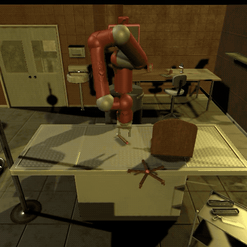
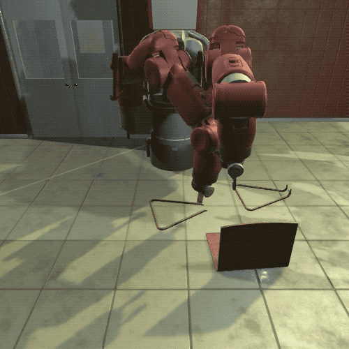
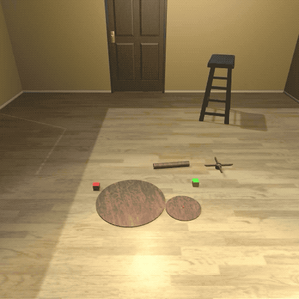

# IKEA Furniture Assembly Environment for Long-Horizon Complex Manipulation Tasks

||||||
| :---: | :---: | :---: |:---: |:---: |
| Sawyer | Baxter | Cursors | Jaco | Panda |


This code contains the **IKEA Furniture Assembly environment** as a first-of-its-kind benchmark for testing and accelerating the automation of physical assembly processes.
An agent (Sawyer, Baxter, Panda, Jaco, Cursor) is required to move, align, and connect furniture parts sequentially.
The task is completed when all parts are connected.


The IKEA Furniture Assembly environment provides:
- Comprehensive modeling of **furniture assembly** task
- 60 furniture models
- Configurable and randomized backgrounds, lighting, textures
- Realistic robot simulation for Baxter, Sawyer, Jaco, Panda, and more
- Gym interface for easy RL training
- Reinforcement learning and imitation learning benchmarks
- Teleopration with 3D mouse/VR controller

<br>

## Directories
The structure of the repository:
- `env`: Envrionment code of the IKEA furniture assembly environment
- `furniture-unity`: Unity code for the IKEA furniture assembly environment (excluded in the supplementary due to the size of files, instead download pre-built Unity app from here: )
- `config`: Configuration files for the environments
- `method`: Reinforcement learning and imitation learning code
- `util`: Utility code
- `docs`: Detail documentation
- `demo_manual.py`: Script for testing the environment with keyboard control


## Prerequisites
- Ubuntu 18.04, MacOS Catalina, Windows10
- Python 3.7 (pybullet may not work with Python 3.8 or higher)
- Mujoco 2.0
- Unity 2018.4.23f1 ([Install using Unity Hub](https://unity3d.com/get-unity/download))


## Installation

1. Install mujoco 2.0 and add the following environment variables into `~/.bashrc` or `~/.zshrc`
```bash
# download mujoco 2.0
$ wget https://www.roboti.us/download/mujoco200_linux.zip -O mujoco.zip
$ unzip mujoco.zip -d ~/.mujoco
$ mv ~/.mujoco/mujoco200_linux ~/.mujoco/mujoco200

# copy mujoco license key `mjkey.txt` to `~/.mujoco`

# add mujoco to LD_LIBRARY_PATH
$ export LD_LIBRARY_PATH=$LD_LIBRARY_PATH:$HOME/.mujoco/mujoco200/bin

# for GPU rendering (replace 418 with your nvidia driver version)
$ export LD_LIBRARY_PATH=$LD_LIBRARY_PATH:/usr/lib/nvidia-418

# only for a headless server
$ export LD_PRELOAD=/usr/lib/x86_64-linux-gnu/libGLEW.so:/usr/lib/nvidia-418/libGL.so
```

For macOS Catalina, you first have to make `libmujoco200.dylib` and `libglfw.dylib` in `~/.mujoco/mujoco200/bin` executable. Otherwise, the files cannot be opened because they are from an unidentified developer. To resolve this issue, navigate to the directory `~/.mujoco/mujoco200/bin`, right click each file, click `open` in the menu, and click the `open` button.

2. Install python dependencies
```bash
# Run the next line for Ubuntu
$ sudo apt-get install libgl1-mesa-dev libgl1-mesa-glx libosmesa6-dev patchelf libopenmpi-dev libglew-dev python3-pip python3-numpy python3-scipy

# Run the next line for macOS
$ brew install gcc
$ brew install openmpi

# Install python dependencies
$ pip install -r requirements.txt

```

3. Download MuJoCo-Unity binary
Download pre-compiled Unity binary for your OS from [this link](https://drive.google.com/drive/folders/1w0RHRYNG8P5nIDXq0Ko5ZshQ2EYS47Zc?usp=sharing) and extract files to `furniture` directory.
```bash
# inside the furniture directory
$ unzip [os]_binary.zip
```
Inside `furniture/binary` there should be `Furniture.app` for macOS, and `Furniture.x86_64, Furniture_Data` for Ubuntu, and `Furniture.exe, Furniture_Data` for Windows.

4. Download demonstrations for imitation learning
Download generated demonstrations `demos.zip` from [this link](https://drive.google.com/drive/folders/1w0RHRYNG8P5nIDXq0Ko5ZshQ2EYS47Zc?usp=sharing) and extract files to `furniture` directory.
The demonstration pickle files can be found in `furniture/demos/Sawyer_[furniture name]/`.
The following python script downloads and unzip the demonstrations.
```bash
$ python scripts/download_demos.py
```

5. Use virtual display for headless servers (optional)
On servers, you don’t have a monitor. Use this to get a virtual monitor for rendering. Set the `--virtual_display` flag to
`:1` when you run the environment.
```bash
# Run the next line for Ubuntu
$ sudo apt-get install xserver-xorg libglu1-mesa-dev freeglut3-dev mesa-common-dev libxmu-dev libxi-dev

# Configure nvidia-x
$ sudo nvidia-xconfig -a --use-display-device=None --virtual=1280x1024

# Launch a virtual display
$ sudo /usr/bin/X :1 &

# Set virtual display flag
$ python -m demo_manual --virtual_display :1
```

## Human control
You can use WASDQE keys for moving and IJKLUO keys for rotating an end-effector of an agent. SPACE and ENTER are closing and opening the gripper, respectively. C key will connect two aligned parts.

```bash
$ python demo_manual.py
```

## IL Training

### Demonstration generation
``` bash
$ python -m env.furniture_sawyer_gen --furniture_name table_dockstra_0279 --start_count 0 --n_demos 100
```

### BC
We provide behavioral cloning (BC) benchmark. You can simply change the furniture name to test on other furniture models.

```bash
$ python -m run --algo bc --run_prefix ik_table_dockstra_0279 --env furniture-sawyer-v0 --gpu 0 --max_episode_steps 500 --furniture_name table_dockstra_0279 --demo_path demos/Sawyer_table_dockstra_0279/Sawyer
```

For evaluation, you can add `--is_train False --num_eval 50` to the training command:
```bash
$ python -m run --algo bc --run_prefix ik_table_dockstra_0279 --env furniture-sawyer-v0 --gpu 0 --max_episode_steps 500 --furniture_name table_dockstra_0279 --demo_path demos/Sawyer_table_dockstra_0279/Sawyer --is_train False --num_eval 50
```

## RL Training

### SAC
```
$ python -m run --algo sac --run_prefix sac_table_dockstra_0279 --env furniture-sawyer-v0 --gpu 0 --max_episode_steps 100 --furniture_name table_dockstra_0279
```
For evaluation, you can add `--is_train False --num_eval 50` to the training command.

### PPO
```
$ python -m run --algo ppo --run_prefix ppo_table_dockstra_0279 --env furniture-sawyer-v0 --gpu 0 --max_episode_steps 100 --furniture_name table_dockstra_0279
```
For evaluation, you can add `--is_train False --num_eval 50` to the training command.

<br>

## More documentation
See [documentation](docs/readme.md) for further details.

<br>

## References
Our Mujoco environment is developed based on Robosuite and Unity implementation from DoorGym-Unity is used.

* Robosuite environment: https://github.com/StanfordVL/robosuite
* MuJoCo-Unity plugin: http://www.mujoco.org/book/unity.html
* DoorGym-Unity: https://github.com/PSVL/DoorGym-Unity
