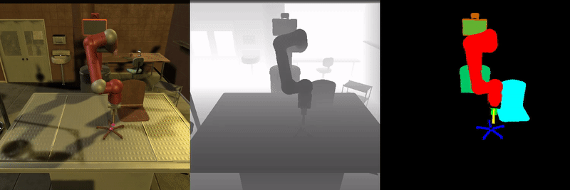

### The current release is a beta release. We welcome any feedback using [this form](https://forms.gle/596eDXmETHLFHD7w7).
<br>

# IKEA Furniture Assembly Environment
[Youngwoon Lee](https://youngwoon.github.io), [Edward S. Hu](https://www.edwardshu.com), Zhengyu Yang, Alex Yin, [Joseph J. Lim](https://clvrai.com) at [USC CLVR lab](https://clvrai.com)   
[[Environment website (https://clvrai.com/furinture)](https://clvrai.com/furniture)]  
[[arXiv Paper](https://arxiv.org/abs/1911.07246)]

||||
| :---: | :---: | :---: |
| Sawyer | Baxter | Cursors |


We are announcing the launch of the **IKEA Furniture Assembly environment** as a first-of-its-kind benchmark for testing and accelerating the automation of physical assembly processes.
An agent (Sawyer, Baxter, Cursor) is asked to move and align furniture parts and connect them one by one.
The task is completed when all parts are assembled.


The IKEA Furniture Assembly environment provides:
- Comprehensive modeling of **furniture assembly** task
- Multiple furniture models, backgrounds, lighting, textures, and more
- Realistic robot simulation (Baxter, Sawyer, and more)
- Gym interface for easy RL training

## A more comprehensive version will come in December, 2019
- [ ] 80+ Furniture models
- [ ] More robots and grippers (e.g. Jaco, Fetch)
- [ ] Reinforcement learning and imitation learning benchmark
- [ ] 3D mouse/VR controller
- [ ] Programmatic changes in lighting and textures

<br>

## (1) Example use cases

### (1.0) Installation
See [`docs/installation.md`](docs/installation.md) for installation.
If you are on a headless server, make sure you run a [virtual display](docs/installation.md#virtual-display) and use `--virtual_display` to specify the display number (e.g. :0 or :1).

### (1.1) Human control

You can use WASDQE keys for moving and IJKLUO keys for rotating an end-effector of an agent.
```bash
python demo_manual.py
```

### (1.2) RL Training
The Gym-like interface makes it easy to use the environment with various RL algorithms. Moreover, users can easily switch furniture models and backgrounds using `reset` method.
We refer the readers to [`furniture/demo_rl.py`](demo_rl.py) for more details.
```py
from env import make_env

# make environment by following arguments
env = make_env('FurnitureBaxterEnv')

# run one episode and collect transitions
done = False

# reset environment
observation = env.reset(furniture_id=1, background='Industrial')

while not done:
    # sample action from policy
    action = pi.act(observation)

    # update unity rendering
    env.render()

    # simulate environment
    observation, reward, done, info = env.step(action)
```

Train block picking up with the provided SAC implementation. It requires 300k steps to pick up a block.
Befoer running the following code, you need to change `furniture/rl/trainer.py:74` with your [wandb](https://wandb.com) entity name for logging. Or, you can disable logging by setting `os.environ['WANDB_MODE'] = 'dryrun'`.
```bash
# gpu: gpu number
python -m rl.main --env FurnitureBaxterBlockEnv --prefix demo --gpu 0 --reward_scale 3
```
See the [`furniture/rl`](rl) folder for a full SAC implementation that uses the IKEA furniture assembly environment.

### (1.3) Gym interface
Gym interface for the IKEA Furniture Assembly environment is also provided, but the furniture model and background should be predefined when registered (see `register` functions in [`furniture/env/__init__.py`](env/__init__.py).
```py
# More details, see furniture/demo_gym.py

import gym

# make an environment
env = gym.make('furniture-baxter-v0')

done = False

# reset environment
observation = env.reset()

while not done:
    # simulate environment
    observation, reward, done, info = env.step(env.action_space.sample())
```

### (1.4) Data generation and observation configuration
See the various observation types (RGB image, segmentation map, depth map,
robot joint state, furniture pose) and generate your own data.
It will show you the various observation options available
to the environment. The video generation can be RAM heavy, so
decrease `--screen_width` and `--screen_height` if it crashes.
There are pre-recorded demonstrations `sawyer_7.pkl, baxter_0.pkl, cursor_7.pkl` in the `demos` folder for
data generation.
```py
python -m demo_vision
```


### (1.5) Demonstration recording and playback
The following script will take the user through the 1) playback of existing
demonstrations and 2) recording and playback of their own demos.
```py
python -m demo_demonstration
```

<br>

## (2) Documentation
See [documentation](docs/readme.md) for installation and configuration details.

<br>

## (3) References
Our Mujoco environment is developed based on Robosuite and Unity implementation from DoorGym-Unity is used.

* Robosuite environment: https://github.com/StanfordVL/robosuite
* MuJoCo-Unity plugin: http://www.mujoco.org/book/unity.html
* DoorGym-Unity: https://github.com/PSVL/DoorGym-Unity
* TensorFlow implementation of SAC: https://github.com/rail-berkeley/softlearning
* PyTorch implementation of SAC: https://github.com/vitchyr/rlkit

<br>

## (4) Citation
```
@article{lee2019ikea,
  title={{IKEA} Furniture Assembly Environment for Long-Horizon Complex Manipulation Tasks},
  author={Lee, Youngwoon and Hu, Edward S and Yang, Zhengyu and Yin, Alex and Lim, Joseph J},
  journal={arXiv preprint arXiv:1911.07246},
  year={2019},
  url={https://clvrai.com/furniture},
}
```


